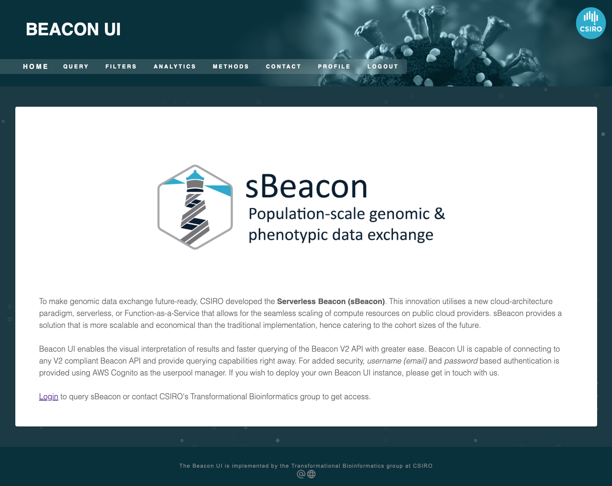

# AskBeacon Code Base

> 🛑 AskBeacon is meant to operate in conjunction with sBeacon. There are detailed instructions on how to set up sBeacon with terraform templates in this rep [https://github.com/aehrc/terraform-aws-serverless-beacon](https://github.com/aehrc/terraform-aws-serverless-beacon). To ensure the connection between sBeacon and askBeacon is robust and secure please get in touch via [http://bioinformatics.csiro.au](http://bioinformatics.csiro.au) to obtain tailored (i.e. security sensitive) instructions. In the meantime we encourage people to get familiar with the system through the set up demo [here](https://d147alp44qcbqe.cloudfront.net/home). 🛑

## Demo Instance

We have hosted a demo instance to allow potential researchers to perform basic evaluation of the system. The demo instance uses `1000 Genomes Phase 3` data. You can access the demo instance using the following link.

🛑 Variant queries of 1000 genomes phase 3 data is associated with `GRCH37`. Hence queries must be of the following form; 

> Get me all the individuals having a variant in first chromosome between 11856377 to 11856379 under assembly id "GRCH37"

<a href="https://d147alp44qcbqe.cloudfront.net/home">AskBeacon Web Interface</a>

<p align="center">
  
</p>

Please use the following credentials
* username: demo@example.com
* password: demo1234

## AskBeacon Core Logic

AskBeacon core logic is presented in this repository. This repository contains the following jupyter notebooks and their functionality is as follows.

## 1 - Extract Information

This notebook outlines how we extract information pertaining to a Beacon query from the user.

## 2 - Ontology Retrieval

This notebook demonmstrate the ontology indexing and retrieval process based on extracted information. This uses the following files.

#### `terms.csv`

This directly comes from sBeacon backend. sBeacon keeps a terms table and has the following format.

| term        | label            | scope   |
| ----------- | ---------------- | ------- |
| OBI:0000070 | genotyping assay | cohorts |
| OBI:0000070 | genotyping assay | cohorts |

#### `embeddings.csv`

This is the resulting file from the embedding of ontology terms. This is loaded into memory and indexed using `docarray` for ontology lookup.

| term        | label            | scope   | embedding                   |
| ----------- | ---------------- | ------- | --------------------------- |
| OBI:0000070 | genotyping assay | cohorts | [-0.06088845431804657, ...] |
| OBI:0000070 | genotyping assay | cohorts | [-0.06088845431804657, ...] |

## 3 - Extraction

This is the extraction portion of the AskBeacon analytics facility. The notebook outlines how we generate the extractor code using the Beacon V2 SDK.

## 4 - Execution

This notebooks shows how we generate the code that we'll be executing to perform the analysis. Note that this notebook relies on the following file.

#### `metadata.json`

This file has the summary information of the extracted data from the previous step.

```json
{
  "table_names": ["data"],
  "table_metadata": [
    [
      [
        "id",
        "diseases",
        ...
      ],
      [
        "int",
        "list",
        "dict",
        ...
      ]
    ]
  ]
}
```

## Utils

You can find the utils we have used under following directories.

#### `utils`

This has pydantic models, templates, vector db and code sanitisers used in our implementation

#### `analytics_utils`

This has the runners of extractors and execution codes. You might also find how we generate the metadata for `metadata.json` here as well.
