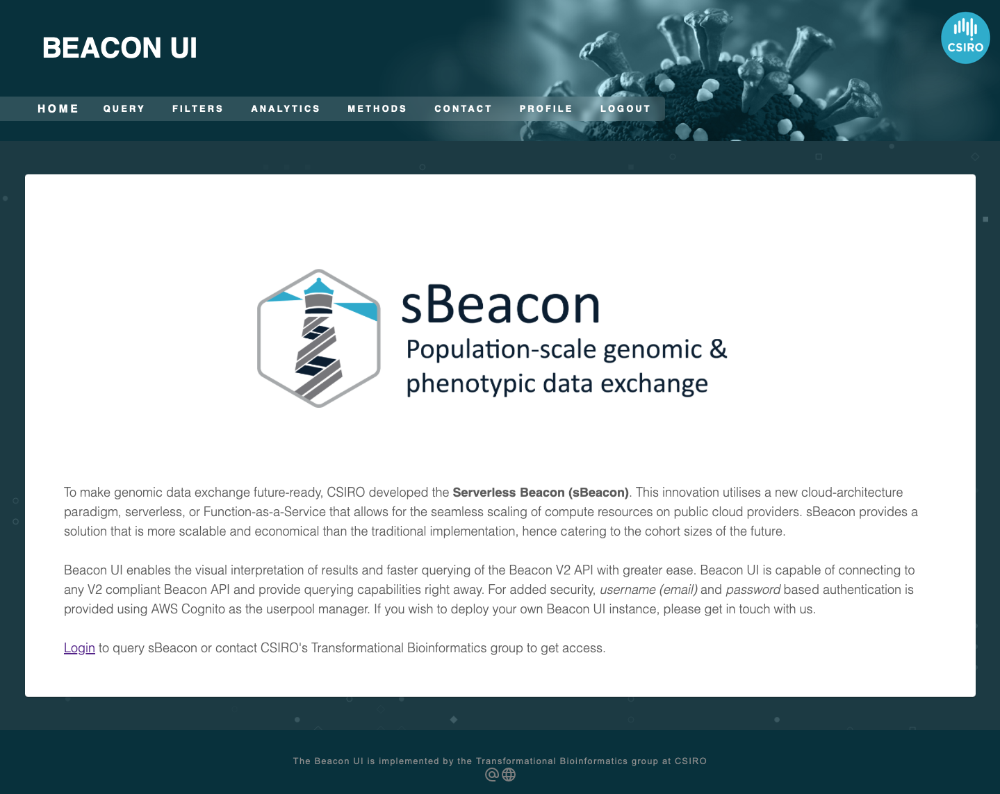
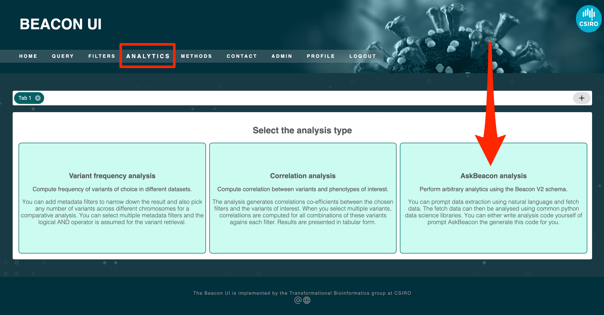
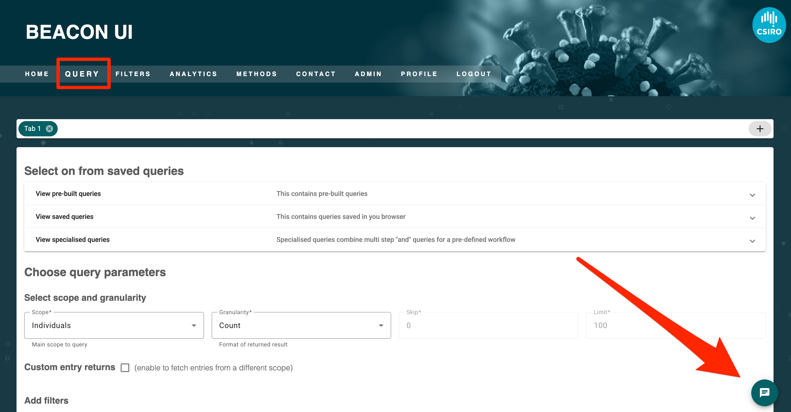

# AskBeacon Code Base

> 🛑 AskBeacon is meant to operate in conjunction with sBeacon. There are detailed instructions on how to set up sBeacon with terraform templates in this rep [https://github.com/aehrc/terraform-aws-serverless-beacon](https://github.com/aehrc/terraform-aws-serverless-beacon). To ensure the connection between sBeacon and askBeacon is robust and secure please get in touch via [http://bioinformatics.csiro.au](http://bioinformatics.csiro.au) to obtain tailored (i.e. security sensitive) instructions. In the meantime we encourage people to get familiar with the system through the set up demo [here](https://d147alp44qcbqe.cloudfront.net/home). 🛑

## Demo Instance

We have hosted a demo instance to allow potential researchers to perform basic evaluation of the system. The demo instance uses `1000 Genomes Phase 3` data. You can access the demo instance using the following link.

🛑 Variant queries of 1000 genomes phase 3 data is associated with `GRCH37`. Hence queries must be of the following form; 

> Get me all the individuals having a variant in first chromosome between 11856377 to 11856379 under assembly id "GRCH37"

<a href="https://d147alp44qcbqe.cloudfront.net/home">Launch the demo</a>

Please use the following credentials
* username: demo@example.com <br>
* password: demo1234<br>

<p>Please note that this AskBeacon instance demonstrates <b>examples 2 and 3 from the paper</b> (i.e. subsets of the 1000 Genome Project). Interactive access to any complete datasets, such as Parkinson's Progression Markers Initiative (example 1) can only be make available by the original data custodians, so this demo is meant solely to showcase AskBeacon's functionality rather than to support research.</p>

<p>AskBeacon Web Interface</p>
<p align="center">
  
</p>

AskBeacon is accessible from `Analytics` tab followed by `AskBeacon analysis` selection as follows.

<p align="center">
  
</p>

AskBeacon can also be acessed through the `Query` tab followed by clicking the chat icon. This capability is for automatically populating the sBeacon UI to interact with the canned sBeacon visualization options. 

<p align="center">
  
</p>

## AskBeacon Core Logic

AskBeacon core logic is presented in this repository. This repository contains the following jupyter notebooks and their functionality is as follows.

## 1 - Extract Information

This notebook outlines how we extract information pertaining to a Beacon query from the user. It evaluates LLM performance on query understanding and information extraction tasks. The notebook initialises LLM models (GPT-4 via Azure OpenAI as well as open-source alternatives such as Mistral, Llama, Gemma and Qwen via Ollama) and extracts four key elements from a user's natural language query:

1. **Scope** – determines the target data scope (e.g. `g_variants`, `cohorts`, `individuals`)
2. **Filters** – identifies disease or condition filters and their associated scope
3. **Granularity** – determines the query type (e.g. `count` vs `record`)
4. **Variants** – parses genomic coordinates (chromosome, start/end positions) and related medical filters

The notebook reads test queries and expected answers from `Queries-and-answers.xlsx` and produces JSON-formatted predictions for each model so that accuracy can be assessed against the ground truth.

## 2 - Ontology Retrieval

This notebook demonstrates the ontology indexing and retrieval process based on extracted information. It builds a semantic search system that matches user-supplied terms to biomedical ontology terms using text embeddings. This uses the following files.

#### `terms.csv`

This directly comes from sBeacon backend. sBeacon keeps a terms table and has the following format.

| term        | label            | scope   |
| ----------- | ---------------- | ------- |
| OBI:0000070 | genotyping assay | cohorts |
| OBI:0000070 | genotyping assay | cohorts |

#### `embeddings.csv`

This is the resulting file from the embedding of ontology terms. This is loaded into memory and indexed using `docarray` for ontology lookup.

| term        | label            | scope   | embedding                   |
| ----------- | ---------------- | ------- | --------------------------- |
| OBI:0000070 | genotyping assay | cohorts | [-0.06088845431804657, ...] |
| OBI:0000070 | genotyping assay | cohorts | [-0.06088845431804657, ...] |

The notebook steps are:

1. **Embed ontology terms** – ontology terms from `terms.csv` are embedded using Azure OpenAI text embeddings and saved to `embeddings.csv`
2. **Index embeddings** – the embeddings are loaded into an in-memory vector database (`InMemoryExactNNIndex` from DocArray)
3. **Semantic retrieval** – a user-supplied natural language term (e.g. `"renal failure"`) is embedded and the nearest ontology terms are returned with similarity scores (e.g. SNOMED:42399005 – *Renal failure* – score 0.91)

## 3 - Extraction

This is the extraction portion of the AskBeacon analytics facility. The notebook outlines how we generate the extractor code using the Beacon V2 SDK. It translates a natural language user query into executable Python code that constructs a Beacon V2 API request.

The notebook steps are:

1. Load the ontology vector database produced in Notebook 2
2. Extract query components (scope, filters, variants, granularity) using an LLM (see Notebook 1)
3. Map each extracted filter term to a formal ontology identifier via semantic search (confidence threshold > 0.9)
4. Generate and format Python code (using Black) that instantiates a `BeaconV2()` SDK object with the appropriate variant parameters, scope, and ontology-mapped filters

For example, the query *"Individuals with Parkinson's with variants in first chromosome from 10000–15000 bases"* produces:

```python
data = (
    BeaconV2()
    .with_g_variant("GRCH38", "N", "N", [10000], [15000], "1")
    .with_scope("individuals")
    .with_filter("ontology", "SNOMED:49049000", "individuals")
    .load()
)
```

## 4 - Execution

This notebook shows how we generate the code that we will be executing to perform the analysis. It takes a natural language analytics request and produces executable Python code (using pandas/matplotlib) that operates on the data retrieved in Notebook 3. Note that this notebook relies on the following file.

#### `metadata.json`

This file has the summary information of the extracted data from the previous step.

```json
{
  "table_names": ["data"],
  "table_metadata": [
    [
      [
        "id",
        "diseases",
        ...
      ],
      [
        "int",
        "list",
        "dict",
        ...
      ]
    ]
  ]
}
```

The notebook steps are:

1. Load table schema information from `metadata.json` (table names, column names, and column types)
2. Format the metadata into a structured description that is passed to the LLM as context
3. Use the LLM to generate executable Python analytics code based on the user's natural language request and the available schema
4. The generated code includes the analytics logic (e.g. plotting, aggregation, CSV export), the file paths for saved outputs, assumptions made about the data structure, and feedback for potential data issues

For example, a request such as *"Plot frequency of karyotypic sex in pie chart"* produces code that creates a matplotlib pie chart of the sex distribution and exports a CSV of individuals with their id, ethnicity, and sex.

## Utils

You can find the utils we have used under following directories.

#### `utils`

This has pydantic models, templates, vector db and code sanitisers used in our implementation

#### `analytics_utils`

This has the runners of extractors and execution codes. You might also find how we generate the metadata for `metadata.json` here as well.
